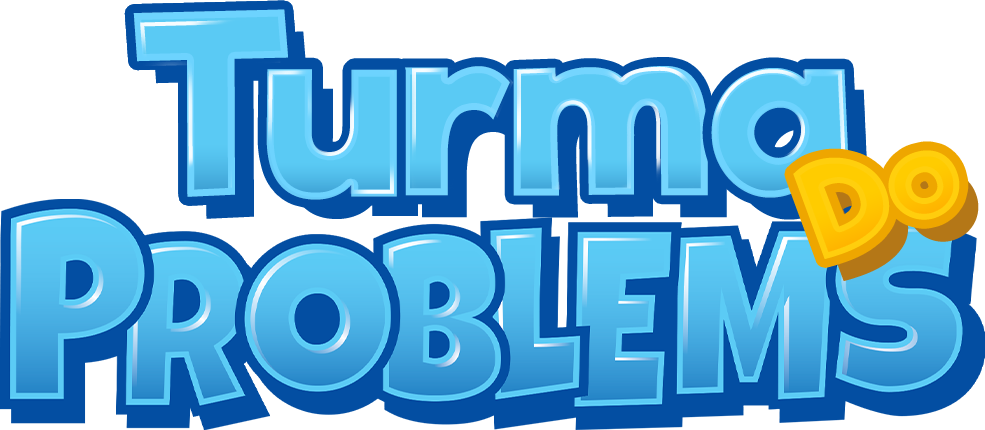
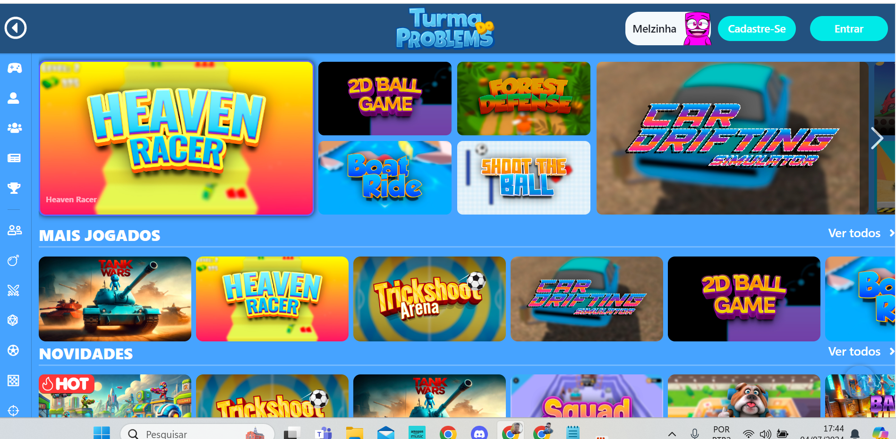
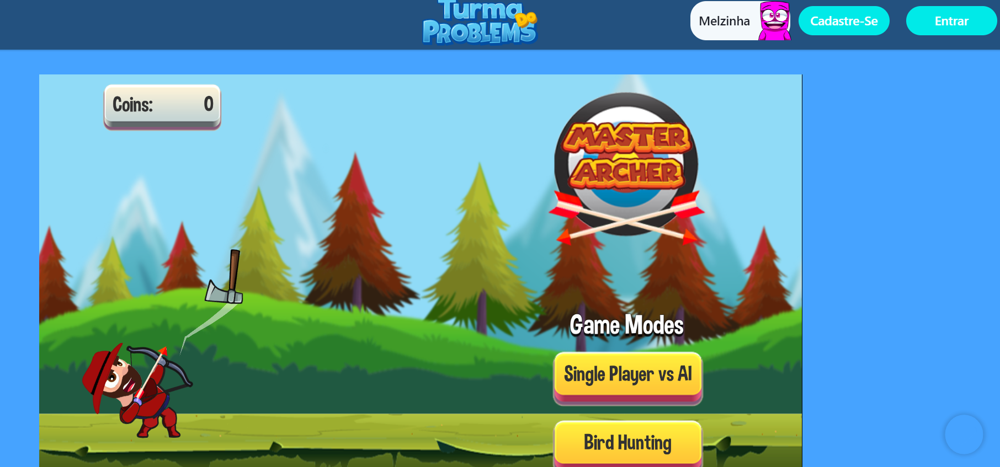
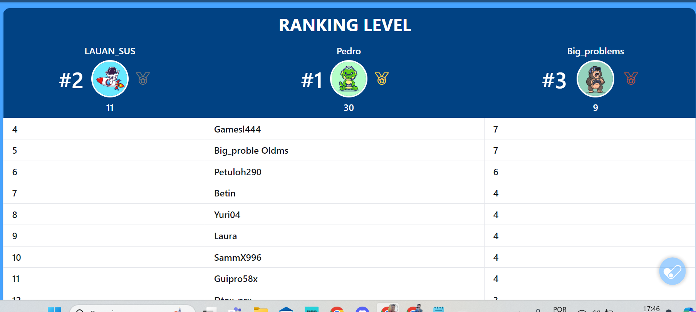

<h1 align="center">
<br>
  
<br>
<br>
PROBLEMS GAMES LTDA
</h1>

<p align="center">
O PROBLEMS GAMES LTDA é um portal de entretenimento online que proporciona aos seus usuários uma experiência diferenciada com uma ampla gama de jogos digitais.</p>

<p align="center">
  <a href="#">
    
  </a>
</p>

<div align="center">

### Apresentação

<br>

### Home


  <br>

  ### Internas

  <br>

   ### Rank de Jogadores

  <br>
  
  <br> 

</div>

 ### Hospedagem 
```sh
 https://theproblemsgames.com.br/
```
 ### Objetivos
```sh
 criação portal de jogos para usuarios apartir de 14 anos , se tornando maior central de jogos online de Criciuma.
 Fazendo parte do grupo de youtubers theproblems

```


<hr />

## Tecnologia usada

```sh
 Em sua maior parte feita no Framework Laravel 5.6 com ultilização de boas praticas no codigo e segurança em nuvem
 Foi feito por um equipe especializada desenvolvedores de jogos e programadores na qual fiz parte com programador Senion 
 
```

Usado do php puro, no servidor linux 

- ⚛️ **Javascript** — json
- ⚛️ **PHP** — PHP para servidor linux
- ⚛️ **Laravel** — utilização tela de login e senha e controle de usuario
- 💹 **JQuery** — Animações
- 💹 **MYSQL** — BD para conteudo
- 💹 **API** — usado para consulta de jogos em outra plataforma


## Modelos

1. Todos os direito autoras pela DevConnetion Criciuma:<br />
3. Modelo apenas ilustratorio<br />


